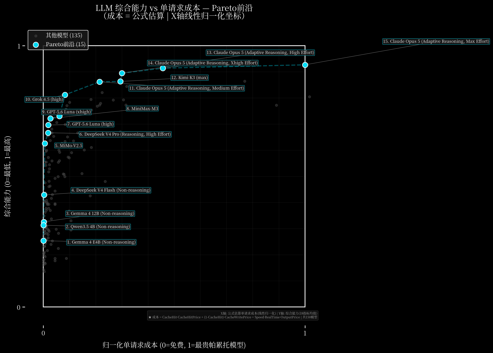

# LLM Leaderboard Pareto Analysis



## Pareto 前沿模型（综合能力从高到低）

| # | 模型 | 综合能力 | 单请求成本 | 归一化成本 | 推理 |
|---|------|---------|-----------|-----------|------|
| 1 | Claude Opus 5 (Adaptive Reasoning, Max Effort) | 0.9267 | 146057.58 | 1.0000 | N |
| 2 | Claude Opus 5 (Adaptive Reasoning, Xhigh Effort) | 0.9140 | 66688.73 | 0.4566 | N |
| 3 | Claude Opus 5 (Adaptive Reasoning, High Effort) | 0.8949 | 43852.40 | 0.3002 | N |
| 4 | Kimi K3 (max) | 0.8631 | 42942.96 | 0.2940 | N |
| 5 | Claude Opus 5 (Adaptive Reasoning, Medium Effort) | 0.8619 | 31425.58 | 0.2152 | N |
| 6 | Grok 4.5 (high) | 0.8119 | 12071.48 | 0.0826 | N |
| 7 | GPT-5.6 Luna (xhigh) | 0.7302 | 8930.94 | 0.0611 | N |
| 8 | MiniMax-M3 | 0.7212 | 3885.01 | 0.0266 | N |
| 9 | GPT-5.6 Luna (high) | 0.6962 | 2737.05 | 0.0187 | N |
| 10 | DeepSeek V4 Pro (Reasoning, High Effort) | 0.6667 | 2594.37 | 0.0178 | N |
| 11 | MiMo-V2.5 | 0.6262 | 852.14 | 0.0058 | N |
| 12 | DeepSeek V4 Flash (Non-reasoning) | 0.4292 | 329.35 | 0.0023 | N |
| 13 | Gemma 4 12B (Non-reasoning) | 0.3257 | 265.85 | 0.0018 | N |
| 14 | Qwen3.5 4B (Non-reasoning) | 0.3129 | 104.20 | 0.0007 | N |
| 15 | Gemma 4 E4B (Non-reasoning) | 0.2537 | 74.80 | 0.0005 | N |

### 评分方法

1. **18项评估指标**各自线性归一化到 [0,1]
2. **综合能力值** = 所有有效归一化分数的算术平均
3. **Pareto前沿** = 不被任何其他模型支配的模型

### 成本计算公式

**X轴成本 = 单请求估算成本（公式）**

```
cost = (CacheHitRate × CacheHitPrice × InputTokens)
     + ((1 − CacheHitRate) × CacheWritePrice × InputTokens)
     + (SpeedMedian × RealTime × OutputPrice)
```

**参数来源与处理逻辑：**

| 参数 | 来源 | 说明 |
|------|------|------|
| CacheHitRate | [AA Coding Agents](https://artificialanalysis.ai/agents/coding-agents) | 全部模型-Agent搭配的 `cacheHitRate` 求平均（52 个有效值，均值 = 0.9095），对所有模型统一使用 |
| CacheHitPrice | AA `cacheHitPrice` | 缓存命中的输入价格 (USD / 1M tokens) |
| CacheWritePrice | AA `cacheWritePrice` | 若缺失，回退到 `price1mInputTokens` (普通输入价格) |
| InputTokens | `10000` | AA 默认的 10k input-token 工作负载（[方法论](https://artificialanalysis.ai/methodology/performance-benchmarking)） |
| SpeedMedian | AA `medianOutputTokensPerSecond` | 输出速度中位数 (tokens/sec)，10k input-token 工作负载下测量 |
| OutputPrice | AA `price1mOutputTokens` | 输出价格 (USD / 1M tokens) |
| RealTime | 见下 | 生成输出 token 的实际耗时（秒） |

**RealTime 计算逻辑：**

- 如果存在 Reasoning Time（推理模型）：
  `RealTime = End-to-End Response Time Total − Latency First Chunk`
  = `medianEndToEndResponseTimeSeconds − medianTimeToFirstTokenSeconds`
- 如果 Reasoning Time 为 `--`（非推理模型）：
  `RealTime = End-to-End Response Time Total`
  = `medianEndToEndResponseTimeSeconds`

**单位说明：** AA 价格以 USD / 1M tokens 为单位，InputTokens 为原始计数（10000），Speed 为 tokens/sec，RealTime 为秒。公式按原样计算，不做单位换算。最终成本是一个相对得分（用于 Pareto 比较和线性归一化），不是真实的美元金额。

### 数据来源

**主数据源**: [Artificial Analysis Leaderboard](https://artificialanalysis.ai/leaderboards/models)  
**Cache Hit Rate 数据源**: [AA Coding Agents](https://artificialanalysis.ai/agents/coding-agents)  
**性能方法论**: [AA Performance Benchmarking](https://artificialanalysis.ai/methodology/performance-benchmarking)  
**模型总数**: 250  