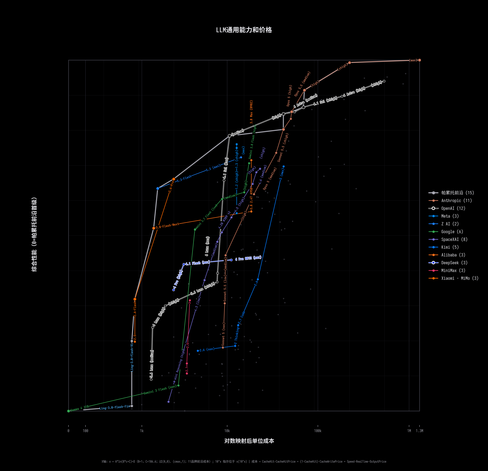

# LLM Leaderboard Pareto Analysis



## 全部模型（综合能力从高到低，最优 = 1，最差 = 0）

共收录 **Status: All**（含已弃用）的全部模型；按重新归一化后的综合能力排序。「帕累托」列：✅ = 总体帕累托前沿模型，❌ = 被支配，— = 无成本数据无法判定。图表纵轴以总体帕累托前沿第一级（y0 = 0.6057，即前沿左端点 K2 Horizon 375B A23B）为 0：综合能力 ≥ 该级且有成本数据的 120 个模型入图，448 个能力低于第一级、18 个缺少成本数据的模型不出现在图中，成本高于品牌前沿最大值的模型同样不入图（本表不受影响，仍完整列出全部模型）。

| # | 品牌 | 模型 | 综合能力 | 单请求成本 | 横轴位置 | 帕累托 |
|---|------|------|---------|-----------|-----------|------|
| 1 |  Anthropic | Claude Opus 5.5 (max with fallback) | 1.0000 | 1,305,735.00 | 1.0000 | ✅ |
| 2 |  Anthropic | Claude Opus 5.5 (xhigh with fallback) | 0.9942 | 231,232.55 | 0.7937 | ✅ |
| 3 |  Anthropic | Claude Sonnet 5.5 (max with fallback) | 0.9793 | 623,518.63 | 0.9119 | ❌ |
| 4 |  Anthropic | Claude Fable 5.1 (max with fallback) | 0.9777 | 838,423.67 | 0.9472 | ❌ |
| 5 |  Anthropic | Claude Fable 5.1 (xhigh with fallback) | 0.9709 | 296,540.59 | 0.8233 | ❌ |
| 6 |  OpenAI | GPT-6 Astra (xhigh) | 0.9667 | 367,852.96 | 0.8490 | ❌ |
| 7 |  OpenAI | GPT-6 Astra (max) | 0.9624 | 860,054.52 | 0.9502 | ❌ |
| 8 |  Google | Gemini 4 Argon (high) | 0.9597 | — | — | — |
| 9 |  Anthropic | Claude Opus 5.5 (high with fallback) | 0.9531 | 64,194.55 | 0.6412 | ✅ |
| 10 |  OpenAI | GPT-6 Astra (high) | 0.9439 | 174,535.37 | 0.7602 | ❌ |
| 11 |  Anthropic | Claude Opus 5 (max) | 0.9388 | 94,555.40 | 0.6872 | ❌ |
| 12 |  Anthropic | Claude Fable 5.1 (high with fallback) | 0.9386 | 95,900.02 | 0.6889 | ❌ |
| 13 |  OpenAI | GPT-6.1 Sol (max) | 0.9364 | 186,507.91 | 0.7681 | ❌ |
| 14 |  OpenAI | GPT-6.1 Sol (xhigh) | 0.9277 | 65,693.36 | 0.6439 | ❌ |
| 15 |  Anthropic | Claude Opus 5 (xhigh) | 0.9242 | 78,551.90 | 0.6652 | ❌ |
| 16 |  Anthropic | Claude Fable 5 (with fallback) | 0.9225 | 325,200.55 | 0.8343 | ❌ |
| 17 |  Anthropic | Claude Opus 5.5 (medium with fallback) | 0.9209 | 48,662.30 | 0.6083 | ✅ |
| 18 |  OpenAI | GPT-6 Astra (medium) | 0.9206 | 51,563.63 | 0.6152 | ❌ |
| 19 |  OpenAI | GPT-6.1 Sol (high) | 0.9179 | 40,490.10 | 0.5866 | ✅ |
| 20 |  Anthropic | Claude Opus 5 (high) | 0.9106 | 46,655.39 | 0.6033 | ❌ |
| 21 |  OpenAI | GPT-5.6 Sol (max) | 0.9096 | 173,633.16 | 0.7595 | ❌ |
| 22 |  Anthropic | Claude Fable 5.1 (medium with fallback) | 0.8999 | 56,044.76 | 0.6251 | ❌ |
| 23 |  Anthropic | Claude Sonnet 5.5 (xhigh with fallback) | 0.8950 | 38,781.55 | 0.5815 | ✅ |
| 24 |  OpenAI | GPT-6.1 Sol (medium) | 0.8851 | 10,285.32 | 0.4256 | ✅ |
| 25 |  OpenAI | GPT-6 Astra (low) | 0.8772 | 47,787.36 | 0.6062 | ❌ |
| 26 |  OpenAI | GPT-6 Sol (max) | 0.8769 | 132,173.63 | 0.7271 | ❌ |
| 27 |  Meta | Muse Spark 1.3 (max) | 0.8725 | 12,759.68 | 0.4507 | ❌ |
| 28 |  Meta | Muse Spark 1.3 (xhigh) | 0.8672 | 12,759.68 | 0.4507 | ❌ |
| 29 |  Anthropic | Claude Fable 5.1 (low with fallback) | 0.8626 | 45,504.42 | 0.6004 | ❌ |
| 30 |  Anthropic | Claude Opus 5 (medium) | 0.8598 | 27,817.78 | 0.5422 | ❌ |
| 31 |  OpenAI | GPT-5.6 Sol (xhigh) | 0.8537 | 71,224.25 | 0.6535 | ❌ |
| 32 |  Z AI | GLM-5.3 (max) | 0.8530 | 14,257.76 | 0.4637 | ❌ |
| 33 |  Alibaba | Qwen3.8 Max (0902) | 0.8488 | 18,509.72 | 0.4942 | ❌ |
| 34 |  Google | Gemini 3.8 Flash (high) | 0.8444 | 18,054.11 | 0.4913 | ❌ |
| 35 |  OpenAI | GPT-5.6 Terra (max) | 0.8435 | 185,598.75 | 0.7675 | ❌ |
| 36 |  Kimi | Kimi K3 (max) | 0.8397 | 42,057.86 | 0.5911 | ❌ |
| 37 |  OpenAI | GPT-5.5 (xhigh) | 0.8362 | 125,370.79 | 0.7208 | ❌ |
| 38 |  SpaceXAI | Grok 4.6 (high) | 0.8361 | 21,681.03 | 0.5128 | ❌ |
| 39 |  SpaceXAI | Grok 4.6 (xhigh) | 0.8309 | 21,294.74 | 0.5107 | ❌ |
| 40 |  OpenAI | GPT-5.6 Sol (high) | 0.8305 | 31,188.93 | 0.5557 | ❌ |
| 41 |  Anthropic | Claude Opus 4.8 (max) | 0.8249 | 101,466.53 | 0.6956 | ❌ |
| 42 |  Xiaomi | MiMo-V2.6-Pro | 0.8215 | 2,459.91 | 0.2653 | ✅ |
| 43 |  OpenAI | GPT-6.1 Sol (low) | 0.8189 | 9,067.31 | 0.4111 | ❌ |
| 44 |  OpenAI | GPT-6 Sol (xhigh) | 0.8181 | 48,231.49 | 0.6073 | ❌ |
| 45 |  StepFun | Step 5 Preview | 0.8161 | 7,798.14 | 0.3937 | ❌ |
| 46 |  SpaceXAI | Grok 4.6 (medium) | 0.8135 | 19,371.62 | 0.4996 | ❌ |
| 47 |  Anthropic | Claude Opus 4.7 (max) | 0.8131 | 49,942.11 | 0.6114 | ❌ |
| 48 |  Z AI | GLM-5.3-Flash | 0.8070 | 1,581.55 | 0.2195 | ✅ |
| 49 |  OpenAI | GPT-5.4 (xhigh) | 0.8063 | 261,146.79 | 0.8081 | ❌ |
| 50 |  OpenAI | GPT-5.5 (high) | 0.8028 | 62,067.60 | 0.6372 | ❌ |
| 51 |  Google | Gemini 3.8 Flash (medium) | 0.8028 | — | — | — |
| 52 |  OpenAI | GPT-5.6 Sol (medium) | 0.8025 | 22,879.35 | 0.5191 | ❌ |
| 53 |  Anthropic | Claude Sonnet 5.5 (high with fallback) | 0.8012 | 20,043.50 | 0.5036 | ❌ |
| 54 |  Google | Gemini 3.7 Flash (high) | 0.8010 | 15,128.82 | 0.4706 | ❌ |
| 55 |  SpaceXAI | Grok 4.7 (xhigh) | 0.8003 | 28,961.98 | 0.5469 | ❌ |
| 56 |  Alibaba | Qwen3.8 Max | 0.7984 | 18,509.72 | 0.4942 | ❌ |
| 57 |  SpaceXAI | Grok 4.7 (high) | 0.7950 | 22,460.47 | 0.5170 | ❌ |
| 58 |  OpenAI | GPT-6 Sol (high) | 0.7940 | 21,843.20 | 0.5137 | ❌ |
| 59 |  Anthropic | Claude Opus 5.5 (low with fallback) | 0.7923 | 29,104.34 | 0.5475 | ❌ |
| 60 |  Google | Gemini 3.7 Flash (medium) | 0.7911 | 8,274.96 | 0.4005 | ❌ |
| 61 |  Google | Gemini 3.5 Flash (medium) | 0.7870 | 31,613.22 | 0.5573 | ❌ |
| 62 |  OpenAI | GPT-5.3 Codex (xhigh) | 0.7869 | 99,186.00 | 0.6929 | ❌ |
| 63 |  Anthropic | Claude Opus 5 (low) | 0.7771 | 24,597.52 | 0.5277 | ❌ |
| 64 |  Alibaba | Qwen3.8 2.4T A95B | 0.7725 | 18,509.72 | 0.4942 | ❌ |
| 65 |  Meta | Muse Spark 1.2 (xhigh) | 0.7699 | 12,759.68 | 0.4507 | ❌ |
| 66 |  Anthropic | Claude Sonnet 5 (max) | 0.7694 | 159,682.05 | 0.7496 | ❌ |
| 67 |  Google | Gemini 3.5 Flash (high) | 0.7683 | 37,289.29 | 0.5768 | ❌ |
| 68 |  SpaceXAI | Grok 4.5 (high) | 0.7636 | 9,592.94 | 0.4176 | ❌ |
| 69 |  OpenAI | GPT-6 Sol (medium) | 0.7609 | — | — | — |
| 70 |  OpenAI | GPT-5.6 Terra (xhigh) | 0.7577 | 34,452.78 | 0.5675 | ❌ |
| 71 |  OpenAI | GPT-5.5 (medium) | 0.7567 | 33,715.58 | 0.5649 | ❌ |
| 72 |  Z AI | GLM-5.2 (max) | 0.7527 | 14,257.76 | 0.4637 | ❌ |
| 73 |  SpaceXAI | Grok 4.7 (low) | 0.7501 | 12,950.21 | 0.4524 | ❌ |
| 74 |  Alibaba | Qwen3.8-Flash-Next | 0.7477 | 1,412.32 | 0.2083 | ✅ |
| 75 |  Google | Gemini 3.1 Pro Preview | 0.7468 | 40,801.89 | 0.5875 | ❌ |
| 76 |  Google | Gemini 3.7 Flash (low) | 0.7453 | 4,566.08 | 0.3329 | ❌ |
| 77 |  Anthropic | Claude Opus 4.6 (max) | 0.7448 | 41,358.01 | 0.5891 | ❌ |
| 78 |  SpaceXAI | Grok 4.20 0309 v2 | 0.7413 | 7,860.24 | 0.3946 | ❌ |
| 79 |  Google | Gemini 3 Pro Preview (high) | 0.7294 | — | — | — |
| 80 |  SpaceXAI | Grok 4.3 (medium) | 0.7274 | 7,468.11 | 0.3887 | ❌ |
| 81 |  OpenAI | GPT-5.6 Sol (low) | 0.7262 | 20,022.74 | 0.5035 | ❌ |
| 82 |  Meta | Muse Spark | 0.7248 | — | — | — |
| 83 |  Meta | Muse Spark 1.1 (xhigh) | 0.7231 | 12,759.68 | 0.4507 | ❌ |
| 84 |  OpenAI | GPT-5.2 (xhigh) | 0.7166 | 134,189.29 | 0.7289 | ❌ |
| 85 |  OpenAI | GPT-5.6 Luna (max) | 0.7163 | 16,298.33 | 0.4793 | ❌ |
| 86 |  OpenAI | GPT-5.2 Codex (xhigh) | 0.7161 | — | — | — |
| 87 |  Google | Gemini 3.6 Flash (high) | 0.7152 | 14,965.11 | 0.4693 | ❌ |
| 88 |  Alibaba | Qwen3.6 Max Preview | 0.7150 | 21,475.07 | 0.5117 | ❌ |
| 89 |  OpenAI | GPT-5.6 Terra (high) | 0.7128 | 12,457.80 | 0.4479 | ❌ |
| 90 |  Anthropic | Claude Sonnet 5.5 (medium with fallback) | 0.7101 | 9,510.73 | 0.4166 | ❌ |
| 91 |  Google | Gemini 3.8 Flash (low) | 0.7071 | — | — | — |
| 92 |  SpaceXAI | Grok 4.20 0309 | 0.7020 | — | — | — |
| 93 |  Anthropic | Claude Opus 4.5 | 0.7012 | 39,252.96 | 0.5829 | ❌ |
| 94 |  DeepSeek | DeepSeek V4 Pro 0813 (max) | 0.7003 | 11,076.23 | 0.4342 | ❌ |
| 95 |  OpenAI | GPT-5.5 (low) | 0.6982 | 26,688.51 | 0.5373 | ❌ |
| 96 |  Anthropic | Claude Opus 4.7 (non-reasoning, high) | 0.6961 | 22,091.82 | 0.5150 | ❌ |
| 97 |  DeepSeek | DeepSeek V4.1 Flash (max) | 0.6938 | 3,229.63 | 0.2946 | ❌ |
| 98 |  Google | Gemini 3 Flash | 0.6855 | 6,356.89 | 0.3703 | ❌ |
| 99 |  SpaceXAI | Grok 4.6 (low) | 0.6821 | 11,751.52 | 0.4411 | ❌ |
| 100 |  Alibaba | Qwen3.7 Max | 0.6811 | 27,971.47 | 0.5428 | ❌ |
| 101 |  OpenAI | GPT-6 Sol (low) | 0.6807 | 9,773.00 | 0.4197 | ❌ |
| 102 |  OpenAI | GPT-6 Luna (max) | 0.6806 | 8,573.09 | 0.4046 | ❌ |
| 103 |  OpenAI | GPT-5.4 (low) | 0.6785 | 13,045.38 | 0.4533 | ❌ |
| 104 |  Motif Technologies | Motif 3 | 0.6775 | — | — | — |
| 105 |  Alibaba | Qwen3.8 27B (xhigh) | 0.6745 | 8,730.79 | 0.4067 | ❌ |
| 106 |  Kimi | Kimi K2.6 | 0.6715 | 21,859.82 | 0.5138 | ❌ |
| 107 |  Alibaba | Qwen3.6 Plus | 0.6706 | 18,909.64 | 0.4967 | ❌ |
| 108 |  SpaceXAI | Grok 4.3 (low) | 0.6702 | 5,413.10 | 0.3521 | ❌ |
| 109 |  Xiaomi | MiMo-V2-Pro | 0.6674 | — | — | — |
| 110 |  OpenAI | GPT-5.6 Luna (xhigh) | 0.6674 | 7,835.87 | 0.3943 | ❌ |
| 111 |  DeepSeek | DeepSeek V4 Flash Vision (max) | 0.6646 | 3,685.80 | 0.3091 | ❌ |
| 112 |  DeepSeek | DeepSeek V4 Flash 0731 (max) | 0.6645 | 3,685.80 | 0.3091 | ❌ |
| 113 |  OpenAI | GPT-5.2 (medium) | 0.6622 | — | — | — |
| 114 |  Anthropic | Claude Sonnet 4.6 (max) | 0.6568 | 92,533.32 | 0.6846 | ❌ |
| 115 |  DeepSeek | DeepSeek V4 Pro (high) | 0.6558 | 2,452.95 | 0.2650 | ❌ |
| 116 |  OpenAI | GPT-5 Codex (high) | 0.6489 | — | — | — |
| 117 |  OpenAI | GPT-5.6 Terra (medium) | 0.6441 | 11,456.71 | 0.4382 | ❌ |
| 118 |  Z AI | GLM-5 | 0.6439 | 13,997.59 | 0.4615 | ❌ |
| 119 |  China Mobile | JT-4.1 Flash 236B A21B | 0.6434 | — | — | — |
| 120 |  Kimi | Kimi K3 (low) | 0.6427 | 42,057.86 | 0.5911 | ❌ |
| 121 |  DeepSeek | DeepSeek V4 Pro (max) | 0.6423 | 4,526.16 | 0.3319 | ❌ |
| 122 |  Xiaomi | MiMo-V2.6-Flash | 0.6419 | 807.16 | 0.1562 | ✅ |
| 123 |  MiniMax | MiniMax-M3 | 0.6401 | 3,781.75 | 0.3120 | ❌ |
| 124 |  Anthropic | Claude Sonnet 5.5 (low with fallback) | 0.6379 | 9,488.46 | 0.4163 | ❌ |
| 125 |  OpenAI | GPT-5.1 (high) | 0.6366 | 42,006.53 | 0.5909 | ❌ |
| 126 |  Alibaba | Qwen3.7 Plus | 0.6321 | 4,984.64 | 0.3428 | ❌ |
| 127 |  OpenAI | GPT-6 Luna (xhigh) | 0.6319 | 1,839.05 | 0.2348 | ❌ |
| 128 |  OpenAI | GPT-5.1 Codex (high) | 0.6308 | — | — | — |
| 129 |  OpenAI | GPT-5.6 Luna (high) | 0.6288 | 2,847.70 | 0.2809 | ❌ |
| 130 |  Xiaomi | MiMo-V2-Omni-0327 | 0.6210 | — | — | — |
| 131 |  Z AI | GLM-5.1 | 0.6205 | 20,655.78 | 0.5071 | ❌ |
| 132 |  OpenAI | GPT-5 (medium) | 0.6189 | 37,339.61 | 0.5770 | ❌ |
| 133 |  Anthropic | Claude Sonnet 5 (xhigh) | 0.6184 | 21,348.24 | 0.5110 | ❌ |
| 134 |  Anthropic | Claude Opus 4.6 (non-reasoning, high) | 0.6116 | 22,686.18 | 0.5181 | ❌ |
| 135 |  Z AI | GLM-5-Turbo | 0.6112 | — | — | — |
| 136 |  Motif Technologies | Motif 3 (Beta) | 0.6097 | — | — | — |
| 137 |  SpaceXAI | Grok 4 | 0.6094 | — | — | — |
| 138 |  Institute of Foundation Models | K2 Horizon 375B A23B | 0.6057 | 0.00 | 0.0000 | ✅ |
| 139 |  Z AI | GLM-5.3 (low) | 0.6045 | 14,257.76 | 0.4637 | ❌ |
| 140 |  Kimi | Kimi K2.7 Code | 0.6030 | 13,254.51 | 0.4551 | ❌ |
| 141 |  SpaceXAI | Grok Build 0.1 0616 | 0.6026 | 7,461.59 | 0.3886 | ❌ |
| 142 |  SpaceXAI | Grok 4.3 (high) | 0.6021 | 9,963.61 | 0.4220 | ❌ |
| 143 |  Nex AGI | Nex-N2-Pro | 0.6018 | — | — | — |
| 144 |  OpenAI | GPT-5.5 Instant (May 2026) | 0.6006 | — | — | — |
| 145 |  OpenAI | GPT-6 Luna (high) | 0.5998 | 1,096.65 | 0.1840 | ❌ |
| 146 |  Anthropic | Claude 4 Opus | 0.5989 | — | — | — |
| 147 |  OpenAI | GPT-5.4 mini (xhigh) | 0.5981 | 120,409.50 | 0.7160 | ❌ |
| 148 |  OpenAI | GPT-5 (high) | 0.5915 | 67,400.56 | 0.6470 | ❌ |
| 149 |  Google | Gemini 3.5 Flash (minimal) | 0.5895 | 8,491.14 | 0.4035 | ❌ |
| 150 |  Alibaba | Qwen3.5 27B | 0.5893 | 6,173.10 | 0.3670 | ❌ |
| 151 |  Xiaomi | MiMo-V2-Flash (Feb 2026) | 0.5890 | — | — | — |
| 152 |  Xiaomi | MiMo-V2-Omni | 0.5868 | — | — | — |
| 153 |  OpenAI | o3 | 0.5862 | 15,079.74 | 0.4702 | ❌ |
| 154 |  Xiaomi | MiMo-V2.5-Pro | 0.5855 | 2,459.91 | 0.2653 | ❌ |
| 155 |  Upstage | Solar Open2 250B | 0.5842 | — | — | — |
| 156 |  OpenAI | GPT-5.6 Terra (low) | 0.5841 | 11,015.40 | 0.4336 | ❌ |
| 157 |  Z AI | GLM 5V Turbo | 0.5824 | — | — | — |
| 158 |  OpenAI | GPT-5.6 Sol (non-reasoning) | 0.5810 | 18,048.82 | 0.4913 | ❌ |
| 159 |  DeepSeek | DeepSeek V4 Flash (max) | 0.5808 | — | — | — |
| 160 |  InclusionAI | Ling-3.0-flash-VL | 0.5795 | — | — | — |
| 161 |  Xiaomi | MiMo-V2.5 | 0.5786 | 807.16 | 0.1562 | ❌ |
| 162 |  Anthropic | Claude Sonnet 5 (high) | 0.5779 | 13,402.66 | 0.4564 | ❌ |
| 163 |  Kimi | Kimi K2.5 | 0.5776 | — | — | — |
| 164 |  OpenAI | GPT-5 mini (medium) | 0.5769 | 3,889.94 | 0.3151 | ❌ |
| 165 |  Anthropic | Claude 4.1 Opus | 0.5744 | — | — | — |
| 166 |  Apodex | Apodex 1.1 | 0.5741 | — | — | — |
| 167 |  Anthropic | Claude Sonnet 4.6 (non-reasoning, high) | 0.5727 | 13,387.13 | 0.4563 | ❌ |
| 168 |  Kimi | Kimi K2 Thinking | 0.5722 | 12,250.00 | 0.4460 | ❌ |
| 169 |  Anthropic | Claude Opus 4.5 (non-reasoning) | 0.5702 | 22,197.23 | 0.5156 | ❌ |
| 170 |  Anthropic | Claude Sonnet 5 (non-reasoning) | 0.5697 | 9,049.55 | 0.4108 | ❌ |
| 171 |  Anthropic | Claude Sonnet 4.6 (non-reasoning, low) | 0.5673 | 13,279.59 | 0.4554 | ❌ |
| 172 |  Thinking Machines | Inkling (xhigh) | 0.5664 | 12,303.90 | 0.4465 | ❌ |
| 173 |  Kimi | Kimi K2.6 (non-reasoning) | 0.5651 | 4,751.81 | 0.3374 | ❌ |
| 174 |  Google | Gemini 3 Pro Preview (low) | 0.5640 | — | — | — |
| 175 |  OpenAI | GPT-5.4 nano (xhigh) | 0.5639 | 17,362.83 | 0.4867 | ❌ |
| 176 |  OpenAI | GPT-6 Luna (medium) | 0.5622 | — | — | — |
| 177 |  Thinking Machines | Inkling Small | 0.5606 | 3,738.48 | 0.3107 | ❌ |
| 178 |  Multiverse Computing | Quasar 438B (max) | 0.5597 | 4,846.19 | 0.3396 | ❌ |
| 179 |  Upstage | Solar Pro 4 | 0.5591 | 3,738.48 | 0.3107 | ❌ |
| 180 |  DeepSeek | DeepSeek V4 Flash (high) | 0.5564 | — | — | — |
| 181 |  OpenAI | GPT-5.1 Codex mini (high) | 0.5556 | — | — | — |
| 182 |  China Mobile | JT-4.1 Flash 236B A21B (non-reasoning) | 0.5550 | — | — | — |
| 183 |  Alibaba | Qwen3.6 27B | 0.5547 | 22,579.79 | 0.5176 | ❌ |
| 184 |  OpenAI | GPT-5 (low) | 0.5517 | 16,695.95 | 0.4821 | ❌ |
| 185 |  Tencent | Hy3-preview | 0.5517 | — | — | — |
| 186 |  Anthropic | Claude 4.5 Sonnet | 0.5476 | 20,541.09 | 0.5065 | ❌ |
| 187 |  MiniMax | MiniMax-M2.5 | 0.5463 | 3,499.06 | 0.3034 | ❌ |
| 188 |  Alibaba | Qwen3.8 27B (medium) | 0.5456 | 8,730.79 | 0.4067 | ❌ |
| 189 |  Z AI | GLM-5.1 (non-reasoning) | 0.5452 | 5,778.54 | 0.3595 | ❌ |
| 190 |  NVIDIA | Nemotron 3 Ultra | 0.5450 | 8,791.37 | 0.4075 | ❌ |
| 191 |  Alibaba | Qwen3.5 Omni Plus | 0.5449 | 3,694.60 | 0.3094 | ❌ |
| 192 |  SpaceXAI | Grok 4.1 Fast | 0.5380 | — | — | — |
| 193 |  Alibaba | Qwen3.5 397B A17B | 0.5373 | 13,615.79 | 0.4583 | ❌ |
| 194 |  KwaiKAT | KAT-Coder-Pro V2 | 0.5328 | — | — | — |
| 195 |  OpenAI | GPT-5.4 nano (medium) | 0.5321 | 2,082.01 | 0.2477 | ❌ |
| 196 |  SK Telecom | A.X-K2 | 0.5317 | — | — | — |
| 197 |  Alibaba | Qwen3.8 27B (low) | 0.5313 | 8,730.79 | 0.4067 | ❌ |
| 198 |  MiniMax | MiniMax-M2.1 | 0.5312 | 3,499.06 | 0.3034 | ❌ |
| 199 |  Alibaba | Qwen3 Max Thinking | 0.5311 | — | — | — |
| 200 |  MiniMax | MiniMax-M2.7 | 0.5309 | 4,336.15 | 0.3272 | ❌ |
| 201 |  Tencent | Hy3 | 0.5279 | 1,786.35 | 0.2319 | ❌ |
| 202 |  Google | Gemini 3.5 Flash-Lite | 0.5270 | 9,578.21 | 0.4174 | ❌ |
| 203 |  Alibaba | Qwen3.5 35B A3B | 0.5258 | 5,144.25 | 0.3463 | ❌ |
| 204 |  OpenAI | GPT-5.6 Luna (medium) | 0.5224 | 1,308.79 | 0.2008 | ❌ |
| 205 |  StepFun | Step 3.7 Flash | 0.5216 | 3,367.32 | 0.2992 | ❌ |
| 206 |  Kimi | Kimi K2.5 (non-reasoning) | 0.5205 | — | — | — |
| 207 |  Xiaomi | MiMo-V2-Flash | 0.5193 | — | — | — |
| 208 |  OpenAI | GPT-5.4 mini (medium) | 0.5181 | 10,161.82 | 0.4242 | ❌ |
| 209 |  Institute of Foundation Models | K2 Horizon MoVA 36B A4B | 0.5173 | — | — | — |
| 210 |  Z AI | GLM-4.7 | 0.5143 | 10,086.55 | 0.4234 | ❌ |
| 211 |  DeepSeek | DeepSeek V3.2 | 0.5135 | — | — | — |
| 212 |  Google | Gemini 3 Flash (non-reasoning) | 0.5135 | 2,803.53 | 0.2793 | ❌ |
| 213 |  OpenAI | GPT-6 Sol (non-reasoning) | 0.5125 | 9,103.66 | 0.4115 | ❌ |
| 214 |  Z AI | GLM-5 (non-reasoning) | 0.5093 | 4,427.59 | 0.3295 | ❌ |
| 215 |  AI9Stars | G9v3-39A5B | 0.5093 | — | — | — |
| 216 |  Alibaba | Qwen3.6 35B A3B | 0.5070 | 13,480.12 | 0.4571 | ❌ |
| 217 |  Anthropic | Claude Sonnet 5 (medium) | 0.5064 | 9,385.91 | 0.4151 | ❌ |
| 218 |  OpenAI | GPT-5.5 (non-reasoning) | 0.5062 | 24,694.62 | 0.5281 | ❌ |
| 219 |  Alibaba | Qwen3.5 397B A17B (non-reasoning) | 0.5026 | 2,807.98 | 0.2794 | ❌ |
| 220 |  StepFun | Step 3.5 Flash 2603 | 0.5025 | 996.16 | 0.1750 | ❌ |
| 221 |  Alibaba | Qwen3.5 122B A10B | 0.4982 | 8,230.79 | 0.3999 | ❌ |
| 222 |  SpaceXAI | Grok 4 Fast | 0.4961 | — | — | — |
| 223 |  Anthropic | Claude 4 Sonnet | 0.4955 | — | — | — |
| 224 |  SpaceXAI | Grok 3 mini Reasoning (high) | 0.4892 | 2,129.82 | 0.2501 | ❌ |
| 225 |  Alibaba | Qwen3.5 27B (non-reasoning) | 0.4878 | 2,492.27 | 0.2667 | ❌ |
| 226 |  Anthropic | Claude 4.5 Sonnet (non-reasoning) | 0.4874 | 13,193.24 | 0.4546 | ❌ |
| 227 |  DeepSeek | DeepSeek V3.2 Speciale | 0.4866 | — | — | — |
| 228 |  China Mobile | JT-35B-Flash | 0.4856 | — | — | — |
| 229 |  StepFun | Step 3.5 Flash | 0.4848 | 996.16 | 0.1750 | ❌ |
| 230 |  InclusionAI | Ling-3.0-flash-Fin | 0.4828 | 734.62 | 0.1481 | ❌ |
| 231 |  LG AI Research | K-EXAONE 2.0 | 0.4818 | — | — | — |
| 232 |  InclusionAI | Ling 3.0 Flash | 0.4785 | 734.62 | 0.1481 | ❌ |
| 233 |  Alibaba | Qwen3.8 27B (non-reasoning) | 0.4755 | 3,300.22 | 0.2970 | ❌ |
| 234 |  Google | Gemma 4 31B | 0.4754 | 0.00 | 0.0000 | ❌ |
| 235 |  OpenAI | GPT-5.4 (non-reasoning) | 0.4725 | 11,993.33 | 0.4435 | ❌ |
| 236 |  MiniMax | MiniMax-M2 | 0.4722 | 3,173.10 | 0.2927 | ❌ |
| 237 |  ByteDance Seed | Doubao Seed Code | 0.4689 | — | — | — |
| 238 |  OpenAI | GPT-5 mini (high) | 0.4688 | 14,135.71 | 0.4627 | ❌ |
| 239 |  OpenAI | o4-mini (high) | 0.4686 | 20,524.16 | 0.5064 | ❌ |
| 240 |  OpenAI | o1 | 0.4686 | — | — | — |
| 241 |  Meta | Muse Glimmer (high) | 0.4675 | 3,939.44 | 0.3165 | ❌ |
| 242 |  Upstage | Solar Mini 4 | 0.4670 | 1,151.93 | 0.1886 | ❌ |
| 243 |  OpenAI | GPT-5.6 Luna (low) | 0.4660 | 1,148.48 | 0.1883 | ❌ |
| 244 |  OpenAI | GPT-6 Luna (low) | 0.4659 | 561.92 | 0.1263 | ❌ |
| 245 |  Z AI | GLM-5.2 (non-reasoning) | 0.4601 | 6,242.41 | 0.3682 | ❌ |
| 246 |  DeepSeek | DeepSeek V4 Pro (non-reasoning) | 0.4574 | 852.88 | 0.1610 | ❌ |
| 247 |  Alibaba | Qwen3.6 27B (non-reasoning) | 0.4545 | 2,869.94 | 0.2818 | ❌ |
| 248 |  Anthropic | Claude 3.7 Sonnet | 0.4532 | — | — | — |
| 249 |  OpenAI | GPT-5.5 Instant (June 2026) | 0.4520 | 82,596.43 | 0.6711 | ❌ |
| 250 |  Anthropic | Claude 4 Sonnet (non-reasoning) | 0.4504 | — | — | — |
| 251 |  Anthropic | Claude Sonnet 5 (low) | 0.4486 | 9,164.80 | 0.4123 | ❌ |
| 252 |  Mistral | Mistral Medium 3.5 | 0.4474 | 21,028.93 | 0.5092 | ❌ |
| 253 |  InclusionAI | Ring-2.6-1T | 0.4462 | 6,423.10 | 0.3715 | ❌ |
| 254 |  Google | Gemini 2.5 Flash (Sep) | 0.4448 | — | — | — |
| 255 |  DeepSeek | DeepSeek V3.2 Exp | 0.4405 | — | — | — |
| 256 |  Amazon | Nova 2.0 Pro Preview (medium) | 0.4398 | 28,661.21 | 0.5457 | ❌ |
| 257 |  KwaiKAT | KAT-Coder-Pro V1 | 0.4396 | — | — | — |
| 258 |  OpenAI | GPT-5.2 (non-reasoning) | 0.4382 | 10,425.41 | 0.4272 | ❌ |
| 259 |  DeepSeek | DeepSeek V4.1 Flash (non-reasoning) | 0.4364 | 1,075.11 | 0.1821 | ❌ |
| 260 |  Anthropic | Claude 4.5 Haiku | 0.4363 | 15,651.92 | 0.4746 | ❌ |
| 261 |  Cohere | Command A+ | 0.4355 | 0.00 | 0.0000 | ❌ |
| 262 |  OpenAI | GPT-5.6 Terra (non-reasoning) | 0.4352 | 10,086.32 | 0.4234 | ❌ |
| 263 |  Alibaba | Qwen3.5 122B A10B (non-reasoning) | 0.4344 | 2,887.15 | 0.2824 | ❌ |
| 264 |  Google | Gemini 2.5 Pro | 0.4334 | 35,505.00 | 0.5710 | ❌ |
| 265 |  Institute of Foundation Models | K2 Horizon 7B | 0.4324 | — | — | — |
| 266 |  Anthropic | Claude 3.7 Sonnet (non-reasoning) | 0.4301 | — | — | — |
| 267 |  Alibaba | Qwen3 Max Thinking (Preview) | 0.4291 | 17,953.91 | 0.4906 | ❌ |
| 268 |  Google | Gemini 2.5 Flash | 0.4240 | 11,026.21 | 0.4337 | ❌ |
| 269 |  Amazon | Nova 2.0 Lite (medium) | 0.4238 | 6,423.10 | 0.3715 | ❌ |
| 270 |  LongCat | LongCat 2.0 | 0.4195 | — | — | — |
| 271 |  Xiaomi | MiMo-V2.5-Pro (non-reasoning) | 0.4190 | 784.73 | 0.1538 | ❌ |
| 272 |  Anthropic | Claude 4.5 Haiku (non-reasoning) | 0.4188 | 4,424.29 | 0.3294 | ❌ |
| 273 |  Google | Gemma 4 26B A4B | 0.4168 | — | — | — |
| 274 |  Kimi | Kimi K2 0905 | 0.4161 | 1,755.79 | 0.2301 | ❌ |
| 275 |  Baidu | ERNIE 5.0 Thinking Preview | 0.4155 | — | — | — |
| 276 |  DeepSeek | DeepSeek V4 Flash (non-reasoning) | 0.4148 | — | — | — |
| 277 |  Alibaba | Qwen3 VL 235B A22B | 0.4147 | 10,230.79 | 0.4250 | ❌ |
| 278 |  Amazon | Nova 2.0 Pro Preview (low) | 0.4135 | 25,721.23 | 0.5329 | ❌ |
| 279 |  DeepSeek | DeepSeek V3.1 Terminus | 0.4129 | — | — | — |
| 280 |  SpaceXAI | Grok 4.20 0309 (non-reasoning) | 0.4123 | — | — | — |
| 281 |  InclusionAI | Ling-2.6-1T | 0.4119 | — | — | — |
| 282 |  Google | Gemini 3.1 Flash-Lite | 0.4112 | 3,420.44 | 0.3009 | ❌ |
| 283 |  Amazon | Nova 2.0 Omni (low) | 0.4084 | — | — | — |
| 284 |  DeepSeek | DeepSeek V3.2 (non-reasoning) | 0.4062 | — | — | — |
| 285 |  Tencent | Hy3-preview (non-reasoning) | 0.4044 | — | — | — |
| 286 |  OpenAI | GPT-5 nano (high) | 0.4043 | 5,896.77 | 0.3618 | ❌ |
| 287 |  OpenAI | GPT-5 nano (medium) | 0.4022 | 2,692.64 | 0.2749 | ❌ |
| 288 |  Z AI | GLM-4.7 (non-reasoning) | 0.4014 | 4,340.66 | 0.3273 | ❌ |
| 289 |  Amazon | Nova 2.0 Omni (medium) | 0.4002 | — | — | — |
| 290 |  Alibaba | Qwen3.6 35B A3B (non-reasoning) | 0.3998 | 2,008.97 | 0.2440 | ❌ |
| 291 |  Alibaba | Qwen3.5 4B | 0.3964 | 392.31 | 0.1001 | ❌ |
| 292 |  SpaceXAI | Grok 4.20 0309 v2 (non-reasoning) | 0.3963 | 4,016.46 | 0.3186 | ❌ |
| 293 |  Z AI | GLM-4.6 | 0.3947 | 6,853.87 | 0.3789 | ❌ |
| 294 |  LG AI Research | EXAONE 4.5 33B | 0.3931 | — | — | — |
| 295 |  DeepSeek | DeepSeek V3.1 | 0.3928 | — | — | — |
| 296 |  Z AI | GLM-4.5 | 0.3922 | — | — | — |
| 297 |  Google | Gemma 4 12B | 0.3878 | 807.70 | 0.1563 | ❌ |
| 298 |  Alibaba | Qwen3.5 9B | 0.3871 | 577.89 | 0.1285 | ❌ |
| 299 |  Amazon | Nova 2.0 Lite (high) | 0.3868 | 6,423.10 | 0.3715 | ❌ |
| 300 |  Alibaba | Qwen3 Max | 0.3864 | 4,546.43 | 0.3324 | ❌ |
| 301 |  SpaceXAI | Grok Code Fast 1 | 0.3836 | — | — | — |
| 302 |  Kimi | Kimi K2 | 0.3826 | 1,659.36 | 0.2244 | ❌ |
| 303 |  DeepSeek | DeepSeek R1 0528 | 0.3812 | — | — | — |
| 304 |  LG AI Research | K-EXAONE | 0.3779 | — | — | — |
| 305 |  Google | Gemini 2.5 Flash (Sep) (non-reasoning) | 0.3756 | — | — | — |
| 306 |  Google | Gemma 4 31B (non-reasoning) | 0.3742 | 1,631.91 | 0.2227 | ❌ |
| 307 |  OpenAI | GPT-5 (minimal) | 0.3728 | 7,735.73 | 0.3928 | ❌ |
| 308 |  Alibaba | Qwen3 VL 32B | 0.3719 | 1,692.32 | 0.2264 | ❌ |
| 309 |  Alibaba | Qwen3.5 35B A3B (non-reasoning) | 0.3715 | 1,853.56 | 0.2357 | ❌ |
| 310 |  OpenAI | GPT-4.1 | 0.3709 | 10,834.75 | 0.4317 | ❌ |
| 311 |  OpenAI | GPT-5.1 (non-reasoning) | 0.3692 | 7,987.31 | 0.3965 | ❌ |
| 312 |  Amazon | Nova 2.0 Lite (low) | 0.3689 | 6,423.10 | 0.3715 | ❌ |
| 313 |  Xiaomi | MiMo-V2-Flash (non-reasoning) | 0.3688 | — | — | — |
| 314 |  Z AI | GLM-4.7-Flash | 0.3678 | 1,134.62 | 0.1872 | ❌ |
| 315 |  Z AI | GLM-4.6 (non-reasoning) | 0.3643 | 5,142.66 | 0.3463 | ❌ |
| 316 |  IBM | Granite 4.2 30B | 0.3642 | 2,094.24 | 0.2483 | ❌ |
| 317 |  ServiceNow | Apriel-v1.5-15B-Thinker | 0.3605 | — | — | — |
| 318 |  SpaceXAI | Grok 4.3 (non-reasoning) | 0.3600 | 4,078.69 | 0.3203 | ❌ |
| 319 |  Alibaba | Qwen3.5 9B (non-reasoning) | 0.3579 | 239.41 | 0.0703 | ❌ |
| 320 |  Alibaba | Qwen3.5 Omni Flash | 0.3566 | 783.58 | 0.1536 | ❌ |
| 321 |  OpenAI | GPT-6 Luna (non-reasoning) | 0.3565 | 460.50 | 0.1113 | ❌ |
| 322 |  Alibaba | Qwen3 Coder 480B | 0.3556 | 5,838.09 | 0.3606 | ❌ |
| 323 |  Google | Gemini 2.5 Flash-Lite (Sep) | 0.3546 | — | — | — |
| 324 |  Deep Cogito | Cogito v2.1 | 0.3543 | — | — | — |
| 325 |  NVIDIA | Nemotron 3 Super | 0.3537 | 3,836.55 | 0.3135 | ❌ |
| 326 |  OpenAI | GPT-5.6 Luna (non-reasoning) | 0.3517 | 1,034.54 | 0.1785 | ❌ |
| 327 |  ServiceNow | Apriel-v1.6-15B-Thinker | 0.3503 | — | — | — |
| 328 |  Inception | Mercury 2 | 0.3497 | 3,896.32 | 0.3153 | ❌ |
| 329 |  Google | Gemma 4 26B A4B (non-reasoning) | 0.3492 | 1,270.96 | 0.1980 | ❌ |
| 330 |  SpaceXAI | Grok 3 | 0.3487 | — | — | — |
| 331 |  Z AI | GLM-4.6V | 0.3479 | 4,095.68 | 0.3208 | ❌ |
| 332 |  DeepSeek | DeepSeek V3.1 Terminus (non-reasoning) | 0.3472 | — | — | — |
| 333 |  NVIDIA | Nemotron Cascade 2 30B A3B | 0.3447 | — | — | — |
| 334 |  OpenAI | GPT-5 (ChatGPT) | 0.3431 | — | — | — |
| 335 |  DeepSeek | DeepSeek V4 Pro 0813 (non-reasoning) | 0.3425 | 4,387.95 | 0.3285 | ❌ |
| 336 |  Institute of Foundation Models | K2 Horizon 3.7B | 0.3372 | — | — | — |
| 337 |  Arcee AI | Trinity Large Thinking | 0.3371 | 2,709.63 | 0.2756 | ❌ |
| 338 |  Mistral | Magistral Medium 1.2 | 0.3363 | — | — | — |
| 339 |  Alibaba | Qwen3 Max (Preview) | 0.3360 | 7,336.69 | 0.3867 | ❌ |
| 340 |  OpenBMB | MiniCPM5-2B | 0.3305 | — | — | — |
| 341 |  DeepSeek | DeepSeek V3.2 Exp (non-reasoning) | 0.3297 | — | — | — |
| 342 |  Google | Gemini 2.5 Flash-Lite (Sep) (non-reasoning) | 0.3273 | — | — | — |
| 343 |  NVIDIA | Nemotron 3.5 Lightning | 0.3270 | 1,005.77 | 0.1759 | ❌ |
| 344 |  DeepSeek | DeepSeek V3.1 (non-reasoning) | 0.3265 | — | — | — |
| 345 |  InclusionAI | Ling 3.0 Tiny | 0.3260 | 0.00 | 0.0000 | ❌ |
| 346 |  OpenAI | gpt-oss-120b (high) | 0.3229 | 2,751.92 | 0.2773 | ❌ |
| 347 |  ByteDance Seed | Seed-OSS-36B-Instruct | 0.3227 | 1,546.17 | 0.2173 | ❌ |
| 348 |  Alibaba | Qwen3 235B A22B 2507 | 0.3199 | 5,882.71 | 0.3615 | ❌ |
| 349 |  Google | Gemini 2.5 Flash (non-reasoning) | 0.3171 | 1,928.34 | 0.2397 | ❌ |
| 350 |  OpenAI | GPT-4o (Aug) | 0.3157 | 19,191.76 | 0.4985 | ❌ |
| 351 |  AI9Stars | G9v3-3B | 0.3156 | — | — | — |
| 352 |  Alibaba | Qwen3 235B 2507 | 0.3153 | 725.33 | 0.1470 | ❌ |
| 353 |  Google | Gemini 2.5 Flash-Lite | 0.3128 | 2,568.31 | 0.2699 | ❌ |
| 354 |  SpaceXAI | Grok 4.1 Fast (non-reasoning) | 0.3090 | — | — | — |
| 355 |  OpenAI | GPT-5 mini (minimal) | 0.3082 | 1,579.80 | 0.2194 | ❌ |
| 356 |  Cohere | North Mini Code | 0.3080 | 0.00 | 0.0000 | ❌ |
| 357 |  Mistral | Mistral Small 4 | 0.3075 | 1,727.89 | 0.2285 | ❌ |
| 358 |  Google | Gemma 4 12B (non-reasoning) | 0.3069 | 291.48 | 0.0813 | ❌ |
| 359 |  Alibaba | Qwen3 VL 235B A22B | 0.3063 | 1,257.56 | 0.1970 | ❌ |
| 360 |  Alibaba | QwQ-32B | 0.3045 | — | — | — |
| 361 |  InclusionAI | Ring-1T | 0.3034 | — | — | — |
| 362 |  OpenBMB | MiniCPM5-1B | 0.3034 | — | — | — |
| 363 |  OpenBMB | MiniCPM5-1B (non-reasoning) | 0.3032 | — | — | — |
| 364 |  Institute of Foundation Models | K2 Think V2 | 0.3026 | — | — | — |
| 365 |  Mistral | Pixtral Large | 0.3021 | — | — | — |
| 366 |  Upstage | Solar Open 100B | 0.2987 | — | — | — |
| 367 |  Multiverse Computing | HyperNova 60B 2605 (high) | 0.2959 | — | — | — |
| 368 |  OpenAI | o3-mini | 0.2958 | 13,697.74 | 0.4590 | ❌ |
| 369 |  Z AI | GLM-4.5-Air | 0.2952 | 2,548.09 | 0.2690 | ❌ |
| 370 |  MiniMax | MiniMax M1 80k | 0.2951 | — | — | — |
| 371 |  OpenAI | GPT-5.4 nano (non-reasoning) | 0.2925 | 1,088.01 | 0.1832 | ❌ |
| 372 |  Alibaba | Qwen3.5 4B (non-reasoning) | 0.2922 | 94.07 | 0.0327 | ❌ |
| 373 |  OpenAI | GPT-4o (Nov) | 0.2905 | 21,840.77 | 0.5137 | ❌ |
| 374 |  China Mobile | JT-MINI | 0.2905 | — | — | — |
| 375 |  Alibaba | Qwen3 Next 80B A3B | 0.2903 | 3,086.55 | 0.2897 | ❌ |
| 376 |  Mistral | Mistral Medium 3 | 0.2886 | — | — | — |
| 377 |  MiniMax | MiniMax M1 40k | 0.2882 | — | — | — |
| 378 |  Naver | HyperCLOVA X SEED Think (32B) | 0.2881 | — | — | — |
| 379 |  SpaceXAI | Grok 4 Fast (non-reasoning) | 0.2864 | — | — | — |
| 380 |  Institute of Foundation Models | K2-V2 (high) | 0.2859 | — | — | — |
| 381 |  LG AI Research | K-EXAONE (non-reasoning) | 0.2856 | — | — | — |
| 382 |  OpenAI | GPT-5.4 mini (non-reasoning) | 0.2852 | 4,048.80 | 0.3195 | ❌ |
| 383 |  Alibaba | Qwen3 Coder Next | 0.2851 | 4,256.65 | 0.3251 | ❌ |
| 384 |  Amazon | Nova 2.0 Pro Preview (non-reasoning) | 0.2846 | 6,888.90 | 0.3795 | ❌ |
| 385 |  Korea Telecom | Mi:dm K 2.5 Pro | 0.2829 | — | — | — |
| 386 |  Upstage | Solar Pro 3 | 0.2825 | 1,727.89 | 0.2285 | ❌ |
| 387 |  IBM | Granite 4.2 8B | 0.2815 | 800.96 | 0.1555 | ❌ |
| 388 |  OpenAI | o3-mini (high) | 0.2805 | 24,864.72 | 0.5289 | ❌ |
| 389 |  Prime Intellect | INTELLECT-3 | 0.2762 | — | — | — |
| 390 |  Google | DiffusionGemma 26B A4B | 0.2760 | — | — | — |
| 391 |  Trillion Labs | Tri-21B-think Preview | 0.2753 | — | — | — |
| 392 |  LongCat | LongCat Flash Lite | 0.2737 | — | — | — |
| 393 |  Alibaba | Qwen3 VL 30B A3B | 0.2734 | 6,115.40 | 0.3659 | ❌ |
| 394 |  OpenAI | gpt-oss-20b (low) | 0.2729 | 577.89 | 0.1285 | ❌ |
| 395 |  Meta | Llama 3.1 405B | 0.2718 | — | — | — |
| 396 |  Amazon | Nova Premier | 0.2710 | — | — | — |
| 397 |  InclusionAI | Ling 2.6 Flash | 0.2706 | — | — | — |
| 398 |  NVIDIA | Nemotron 3 Nano | 0.2699 | 1,000.00 | 0.1754 | ❌ |
| 399 |  Google | Gemma 4 E4B (non-reasoning) | 0.2698 | 67.39 | 0.0243 | ❌ |
| 400 |  Trillion Labs | Tri-21B-Think | 0.2696 | — | — | — |
| 401 |  Inception | Mercury 2.5 | 0.2629 | 2,503.97 | 0.2671 | ❌ |
| 402 |  Amazon | Nova 2.0 Lite (non-reasoning) | 0.2625 | 1,885.61 | 0.2374 | ❌ |
| 403 |  Alibaba | Qwen3 Next 80B A3B | 0.2618 | 1,121.72 | 0.1861 | ❌ |
| 404 |  Alibaba | Qwen3 VL 32B | 0.2615 | 533.97 | 0.1224 | ❌ |
| 405 |  NVIDIA | Nemotron 3 Nano Omni 30B A3B | 0.2601 | 4,687.50 | 0.3359 | ❌ |
| 406 |  Nous Research | Hermes 4 405B | 0.2598 | 8,076.99 | 0.3977 | ❌ |
| 407 |  OpenAI | GPT-4.1 mini | 0.2588 | 2,144.32 | 0.2508 | ❌ |
| 408 |  DeepSeek | DeepSeek R1 (Jan) | 0.2582 | — | — | — |
| 409 |  Institute of Foundation Models | K2-V2 (medium) | 0.2573 | — | — | — |
| 410 |  InclusionAI | Ling-1T | 0.2565 | — | — | — |
| 411 |  DeepSeek | DeepSeek V3 0324 | 0.2564 | — | — | — |
| 412 |  Google | Gemma 4 E4B | 0.2562 | 261.54 | 0.0751 | ❌ |
| 413 |  Korea Telecom | Mi:dm K 2.5 Pro Preview | 0.2561 | — | — | — |
| 414 |  Motif Technologies | Motif-2-12.7B | 0.2560 | — | — | — |
| 415 |  Mistral | Mistral Large 3 | 0.2539 | 1,643.78 | 0.2234 | ❌ |
| 416 |  Mistral | Mistral Medium 3.1 | 0.2531 | — | — | — |
| 417 |  Alibaba | Qwen3 VL 8B | 0.2529 | 5,353.86 | 0.3508 | ❌ |
| 418 |  OpenAI | gpt-oss-20b (high) | 0.2513 | 490.39 | 0.1159 | ❌ |
| 419 |  StepFun | Step3 VL 10B | 0.2511 | — | — | — |
| 420 |  Meta | Llama 4 Maverick | 0.2497 | 2,989.16 | 0.2862 | ❌ |
| 421 |  NVIDIA | Llama Nemotron Super 49B v1.5 | 0.2490 | — | — | — |
| 422 |  Google | Gemini 2.0 Flash | 0.2487 | — | — | — |
| 423 |  Z AI | GLM-4.7-Flash (non-reasoning) | 0.2486 | 674.40 | 0.1410 | ❌ |
| 424 |  OpenAI | gpt-oss-120b (low) | 0.2477 | 2,862.50 | 0.2815 | ❌ |
| 425 |  Baidu | ERNIE 4.5 300B A47B | 0.2459 | — | — | — |
| 426 |  Mistral | Magistral Medium 1 | 0.2449 | — | — | — |
| 427 |  Mistral | Devstral Medium | 0.2433 | — | — | — |
| 428 |  Alibaba | Qwen3 4B 2507 | 0.2428 | — | — | — |
| 429 |  Anthropic | Claude 3.5 Haiku | 0.2422 | — | — | — |
| 430 |  Amazon | Nova 2.0 Omni (non-reasoning) | 0.2422 | — | — | — |
| 431 |  OpenAI | GPT-4 | 0.2422 | — | — | — |
| 432 |  Mistral | Mistral Small 4 (non-reasoning) | 0.2417 | 601.79 | 0.1317 | ❌ |
| 433 |  Nous Research | Hermes 4 405B (non-reasoning) | 0.2406 | 2,327.07 | 0.2594 | ❌ |
| 434 |  Alibaba | Qwen3 Coder 30B A3B | 0.2393 | 1,887.45 | 0.2375 | ❌ |
| 435 |  Alibaba | Qwen3 30B A3B 2507 | 0.2372 | 6,115.40 | 0.3659 | ❌ |
| 436 |  Liquid AI | LFM2.5-8B-A1B | 0.2370 | — | — | — |
| 437 |  Alibaba | Qwen3 VL 30B A3B | 0.2362 | 714.13 | 0.1457 | ❌ |
| 438 |  Mistral | Devstral 2 | 0.2360 | — | — | — |
| 439 |  Z AI | GLM-4.6V (non-reasoning) | 0.2356 | 2,590.78 | 0.2708 | ❌ |
| 440 |  Alibaba | Qwen3 Omni 30B A3B | 0.2338 | 2,569.25 | 0.2699 | ❌ |
| 441 |  IBM | Granite 4.2 3B | 0.2332 | 387.98 | 0.0994 | ❌ |
| 442 |  Alibaba | Qwen3 235B | 0.2297 | 21,403.89 | 0.5113 | ❌ |
| 443 |  Z AI | GLM-4.5V | 0.2289 | 5,882.72 | 0.3615 | ❌ |
| 444 |  NVIDIA | NVIDIA Nemotron Nano 12B v2 VL | 0.2282 | — | — | — |
| 445 |  Mistral | Mistral Large 2 (Nov) | 0.2272 | — | — | — |
| 446 |  TII UAE | Falcon-H1R-7B | 0.2258 | — | — | — |
| 447 |  NVIDIA | Llama Nemotron Ultra | 0.2248 | — | — | — |
| 448 |  Google | Gemma 4 E2B | 0.2160 | — | — | — |
| 449 |  Amazon | Nova Pro | 0.2158 | — | — | — |
| 450 |  Mistral | Devstral Small 2 | 0.2157 | — | — | — |
| 451 |  Liquid AI | LFM2.5-2.6B | 0.2152 | — | — | — |
| 452 |  Allen Institute for AI | Olmo 3.1 32B Think | 0.2150 | — | — | — |
| 453 |  Sarvam | Sarvam 105B (high) | 0.2141 | — | — | — |
| 454 |  LG AI Research | EXAONE 4.0 32B | 0.2132 | — | — | — |
| 455 |  Institute of Foundation Models | K2-V2 (low) | 0.2117 | — | — | — |
| 456 |  NVIDIA | NVIDIA Nemotron Nano 9B V2 | 0.2112 | 423.08 | 0.1053 | ❌ |
| 457 |  InclusionAI | Ring-flash-2.0 | 0.2087 | — | — | — |
| 458 |  Google | Gemini 2.5 Flash-Lite (non-reasoning) | 0.2086 | 391.51 | 0.1000 | ❌ |
| 459 |  NVIDIA | Llama Nemotron Super 49B v1.5 (non-reasoning) | 0.2070 | — | — | — |
| 460 |  Nous Research | Hermes 4 70B | 0.2050 | — | — | — |
| 461 |  Mistral | Devstral Small (May) | 0.2040 | — | — | — |
| 462 |  Amazon | Nova Lite | 0.2033 | 336.16 | 0.0900 | ❌ |
| 463 |  Mistral | Magistral Small 1.2 | 0.2005 | — | — | — |
| 464 |  NVIDIA | Llama 3.3 Nemotron Super 49B | 0.2003 | — | — | — |
| 465 |  DeepSeek | DeepSeek R1 Distill Qwen 32B | 0.1999 | — | — | — |
| 466 |  DeepSeek | DeepSeek V3 (Dec) | 0.1997 | — | — | — |
| 467 |  Alibaba | Qwen2.5 72B | 0.1993 | — | — | — |
| 468 |  InclusionAI | Ling-flash-2.0 | 0.1984 | 371.17 | 0.0964 | ❌ |
| 469 |  Nanbeige | Nanbeige4.1-3B | 0.1982 | — | — | — |
| 470 |  Alibaba | Qwen3 VL 8B | 0.1979 | 641.92 | 0.1369 | ❌ |
| 471 |  Alibaba | Qwen3.5 2B | 0.1969 | — | — | — |
| 472 |  Alibaba | Qwen3 30B | 0.1964 | 6,115.40 | 0.3659 | ❌ |
| 473 |  Mistral | Magistral Small 1 | 0.1960 | — | — | — |
| 474 |  Mistral | Mistral Large 2 (Jul) | 0.1921 | — | — | — |
| 475 |  Upstage | Solar Pro 2 | 0.1913 | — | — | — |
| 476 |  Cohere | Command A | 0.1912 | 7,527.41 | 0.3896 | ❌ |
| 477 |  Mistral | Devstral Small | 0.1906 | — | — | — |
| 478 |  Mistral | Mistral Small 3.2 | 0.1905 | — | — | — |
| 479 |  Alibaba | Qwen3 235B (non-reasoning) | 0.1903 | 2,297.52 | 0.2580 | ❌ |
| 480 |  NVIDIA | Llama 3.1 Nemotron 70B | 0.1890 | — | — | — |
| 481 |  Alibaba | Qwen3 VL 4B | 0.1864 | — | — | — |
| 482 |  Anthropic | Claude 3 Haiku | 0.1854 | — | — | — |
| 483 |  NVIDIA | Llama 3.3 Nemotron Super 49B (non-reasoning) | 0.1838 | — | — | — |
| 484 |  Alibaba | Qwen3 30B A3B 2507 (non-reasoning) | 0.1821 | 729.43 | 0.1475 | ❌ |
| 485 |  Meta | Llama 4 Scout | 0.1817 | 509.37 | 0.1188 | ❌ |
| 486 |  Alibaba | Qwen3 4B | 0.1806 | — | — | — |
| 487 |  Meta | Llama 3.1 70B | 0.1801 | 648.64 | 0.1378 | ❌ |
| 488 |  NVIDIA | NVIDIA Nemotron Nano 9B V2 (non-reasoning) | 0.1799 | 194.70 | 0.0599 | ❌ |
| 489 |  Alibaba | Qwen3 32B | 0.1790 | 1,692.32 | 0.2264 | ❌ |
| 490 |  Alibaba | Qwen3 32B (non-reasoning) | 0.1784 | 589.17 | 0.1300 | ❌ |
| 491 |  Mistral | Mistral Small 3.1 | 0.1783 | — | — | — |
| 492 |  Z AI | GLM-4.5V (non-reasoning) | 0.1780 | 2,567.19 | 0.2698 | ❌ |
| 493 |  Google | Gemma 4 E2B (non-reasoning) | 0.1779 | — | — | — |
| 494 |  Alibaba | Qwen3 14B | 0.1744 | 10,701.94 | 0.4303 | ❌ |
| 495 |  Mistral | Ministral 3 14B | 0.1730 | 416.57 | 0.1042 | ❌ |
| 496 |  Allen Institute for AI | Olmo 3.1 32B Instruct | 0.1725 | — | — | — |
| 497 |  Alibaba | Qwen3 Omni 30B A3B | 0.1708 | 805.71 | 0.1561 | ❌ |
| 498 |  OpenAI | GPT-5 nano (minimal) | 0.1702 | 324.59 | 0.0878 | ❌ |
| 499 |  Alibaba | Qwen3 4B 2507 (non-reasoning) | 0.1691 | — | — | — |
| 500 |  Allen Institute for AI | Olmo 3 32B Think | 0.1648 | — | — | — |
| 501 |  DeepSeek | DeepSeek R1 Distill Llama 70B | 0.1641 | — | — | — |
| 502 |  DeepSeek | DeepSeek R1 Distill Qwen 14B | 0.1637 | — | — | — |
| 503 |  Kimi | Kimi Linear 48B A3B Instruct | 0.1634 | — | — | — |
| 504 |  IBM | Granite 4.1 30B | 0.1627 | — | — | — |
| 505 |  Upstage | Solar Pro 2 (non-reasoning) | 0.1619 | — | — | — |
| 506 |  Alibaba | Qwen3.5 2B (non-reasoning) | 0.1618 | — | — | — |
| 507 |  NVIDIA | Nemotron 3 Nano 4B | 0.1595 | — | — | — |
| 508 |  Nous Research | Hermes 4 70B (non-reasoning) | 0.1588 | — | — | — |
| 509 |  AI21 Labs | Jamba Reasoning 3B | 0.1585 | — | — | — |
| 510 |  LG AI Research | EXAONE 4.0 32B (non-reasoning) | 0.1563 | — | — | — |
| 511 |  Meta | Llama 3.3 70B | 0.1546 | 7,558.91 | 0.3901 | ❌ |
| 512 |  OpenAI | GPT-4.1 nano | 0.1544 | 523.59 | 0.1209 | ❌ |
| 513 |  Meta | Llama 3.1 8B | 0.1538 | 42.74 | 0.0160 | ❌ |
| 514 |  Amazon | Nova Micro | 0.1534 | 206.55 | 0.0627 | ❌ |
| 515 |  Liquid AI | LFM2 24B A2B | 0.1530 | — | — | — |
| 516 |  AI21 Labs | Jamba 1.7 Large | 0.1519 | — | — | — |
| 517 |  Sarvam | Sarvam 30B (high) | 0.1500 | — | — | — |
| 518 |  OpenAI | GPT-4o mini | 0.1494 | 1,146.64 | 0.1882 | ❌ |
| 519 |  Mistral | Mistral Small 3 | 0.1486 | — | — | — |
| 520 |  NVIDIA | NVIDIA Nemotron Nano 12B v2 VL (non-reasoning) | 0.1483 | 546.34 | 0.1241 | ❌ |
| 521 |  Celeris | Celeris-1 | 0.1463 | 1,083.35 | 0.1828 | ❌ |
| 522 |  IBM | Granite 4.1 8B | 0.1446 | — | — | — |
| 523 |  Alibaba | Qwen3 30B (non-reasoning) | 0.1438 | 703.88 | 0.1445 | ❌ |
| 524 |  Mistral | Ministral 3 8B | 0.1429 | 314.02 | 0.0858 | ❌ |
| 525 |  NVIDIA | Nemotron 3 Nano (non-reasoning) | 0.1412 | 633.73 | 0.1359 | ❌ |
| 526 |  IBM | Granite 4.0 H Small | 0.1380 | 284.37 | 0.0798 | ❌ |
| 527 |  Alibaba | Qwen3 VL 4B | 0.1376 | — | — | — |
| 528 |  OpenBMB | MiniCPM-V 4.6 1.3B | 0.1357 | — | — | — |
| 529 |  DeepSeek | DeepSeek R1 0528 Qwen3 8B | 0.1336 | — | — | — |
| 530 |  Alibaba | Qwen3 14B (non-reasoning) | 0.1319 | 1,149.47 | 0.1884 | ❌ |
| 531 |  Alibaba | Qwen3 8B | 0.1309 | 5,353.86 | 0.3508 | ❌ |
| 532 |  Microsoft | Phi-4 | 0.1273 | 368.35 | 0.0959 | ❌ |
| 533 |  NVIDIA | Llama 3.1 Nemotron Nano 4B v1.1 | 0.1264 | — | — | — |
| 534 |  Google | Gemma 3 270M | 0.1243 | — | — | — |
| 535 |  Google | Gemma 3 27B | 0.1199 | — | — | — |
| 536 |  Meta | Llama 3 70B | 0.1192 | — | — | — |
| 537 |  Meta | Llama 3.2 11B (Vision) | 0.1187 | 393.20 | 0.1003 | ❌ |
| 538 |  Meta | Llama 3.2 3B | 0.1168 | — | — | — |
| 539 |  Allen Institute for AI | Olmo 3 7B Think | 0.1153 | — | — | — |
| 540 |  Mistral | Ministral 3 3B | 0.1137 | 216.40 | 0.0650 | ❌ |
| 541 |  Liquid AI | LFM2.5-1.2B-Instruct | 0.1087 | — | — | — |
| 542 |  Reka AI | Reka Flash 3 | 0.1082 | 2,115.40 | 0.2493 | ❌ |
| 543 |  InclusionAI | Ling-mini-2.0 | 0.1078 | — | — | — |
| 544 |  Liquid AI | LFM2 2.6B | 0.1077 | — | — | — |
| 545 |  Alibaba | Qwen3 8B (non-reasoning) | 0.1068 | 560.56 | 0.1261 | ❌ |
| 546 |  Alibaba | Qwen3.5 0.8B | 0.1058 | — | — | — |
| 547 |  Allen Institute for AI | Molmo2-8B | 0.1035 | — | — | — |
| 548 |  Sarvam | Sarvam M | 0.1033 | — | — | — |
| 549 |  AI21 Labs | Jamba 1.7 Mini | 0.1020 | — | — | — |
| 550 |  Liquid AI | LFM2.5-1.2B-Thinking | 0.1006 | — | — | — |
| 551 |  Swiss AI Initiative | Apertus 70B Instruct | 0.0938 | — | — | — |
| 552 |  Allen Institute for AI | Olmo 3 7B | 0.0924 | — | — | — |
| 553 |  LG AI Research | Exaone 4.0 1.2B | 0.0914 | — | — | — |
| 554 |  Allen Institute for AI | OLMo 2 32B | 0.0913 | — | — | — |
| 555 |  IBM | Granite 4.0 H 1B | 0.0908 | — | — | — |
| 556 |  Meta | Llama 3.2 1B | 0.0897 | — | — | — |
| 557 |  Microsoft | Phi-4 Mini | 0.0891 | 0.00 | 0.0000 | ❌ |
| 558 |  Alibaba | Qwen3 1.7B | 0.0886 | — | — | — |
| 559 |  Alibaba | Qwen3.5 0.8B (non-reasoning) | 0.0853 | — | — | — |
| 560 |  LG AI Research | Exaone 4.0 1.2B (non-reasoning) | 0.0844 | — | — | — |
| 561 |  Google | Gemma 3 12B | 0.0836 | — | — | — |
| 562 |  Liquid AI | LFM2 8B A1B | 0.0826 | — | — | — |
| 563 |  IBM | Granite 4.0 Micro | 0.0800 | — | — | — |
| 564 |  IBM | Granite 4.1 3B | 0.0793 | — | — | — |
| 565 |  Microsoft | Phi-3 Mini | 0.0751 | — | — | — |
| 566 |  IBM | Granite 3.3 8B (non-reasoning) | 0.0717 | 249.56 | 0.0725 | ❌ |
| 567 |  Liquid AI | LFM2.5-VL-1.6B | 0.0691 | — | — | — |
| 568 |  IBM | Granite 4.0 1B | 0.0684 | — | — | — |
| 569 |  IBM | Granite 4.0 350M | 0.0674 | — | — | — |
| 570 |  Liquid AI | LFM2 1.2B | 0.0655 | — | — | — |
| 571 |  Alibaba | Qwen3 0.6B | 0.0649 | — | — | — |
| 572 |  Meta | Llama 3 8B | 0.0646 | — | — | — |
| 573 |  Mistral | Mistral 7B | 0.0622 | — | — | — |
| 574 |  Google | Gemma 3 4B | 0.0603 | — | — | — |
| 575 |  Alibaba | Qwen3 1.7B (non-reasoning) | 0.0567 | — | — | — |
| 576 |  Allen Institute for AI | OLMo 2 7B | 0.0565 | — | — | — |
| 577 |  Google | Gemma 3 1B | 0.0561 | — | — | — |
| 578 |  Swiss AI Initiative | Apertus 8B Instruct | 0.0552 | — | — | — |
| 579 |  Google | Gemma 3n E4B | 0.0532 | — | — | — |
| 580 |  IBM | Granite 4.0 H 350M | 0.0510 | — | — | — |
| 581 |  Allen Institute for AI | Molmo 7B-D | 0.0478 | — | — | — |
| 582 |  Institute of Foundation Models | K2 Horizon 0.9B | 0.0458 | — | — | — |
| 583 |  Alibaba | Qwen3 0.6B (non-reasoning) | 0.0438 | — | — | — |
| 584 |  Google | Gemma 3n E2B | 0.0361 | — | — | — |
| 585 |  Cohere | Tiny Aya Global | 0.0357 | — | — | — |
| 586 |  DeepSeek | DeepSeek R1 Distill Qwen 1.5B | 0.0000 | — | — | — |

## 品牌帕累托前沿连线（仅体现在图中）

以下十一个品牌在图中拥有单独的帕累托连线（较窄宽度，品牌主题色，图层高于总体灰色连线）。表中数量为**入图顶点数**——品牌前沿上低于总体前沿第一级的顶点同样不入图（本表与图例一致）：

| 品牌 | 主题色 | 品牌前沿模型数（入图） |
|------|--------|--------------|
|  Anthropic | `#cc785c` | 10 |
|  OpenAI | `#1f1f1f` | 10 |
|  Meta | `#0089f4` | 4 |
|  Z AI | `#1c7ff8` | 2 |
|  Google | `#34A853` | 4 |
|  SpaceXAI | `#736cd3` | 7 |
|  Kimi | `#047AFE` | 2 |
|  Alibaba | `#ff7018` | 3 |
|  DeepSeek | `#2243e6` | 3 |
|  MiniMax | `#EB3568` | 1 |
|  Xiaomi | `#ff6900` | 2 |

## 评分方法

1. **20项评估指标**各自线性归一化到 [0,1]
   （AA Intelligence Index、GPQA Diamond、Humanity's Last Exam、MMMU Pro、IFBench Instruction Following、SciCode Coding、CritPt Physics、AA-LCR Long Context、AA Omniscience Index、AA-Omniscience Accuracy、AA-Omniscience Non-Hallucination、GDPval-AA Normalized、AA Analyst Agent、APEX-Agents-AA、ITBench-SRE、τ²-Bench Telecom、τ³-Bench Banking、Terminal-Bench Hard、Terminal-Bench 2.1、Terminal-Bench 4.0）
   > V18（2026-09-12）：AA 更新了基准列——新增 AA Analyst Agent、τ³-Bench Banking、Terminal-Bench 2.1 / 4.0 四项；AA Agentic Index 与 AA Coding Index 已从 AA 的数据源中移除，相应剔除。指标数由 18 → 20。
2. **综合能力值** = 所有有效归一化分数的算术平均
3. **综合能力再归一化**：线性映射到 [0,1]，性能最好的模型 = 1，最差的模型 = 0
4. **Pareto前沿** = 不被任何其他模型支配的模型（综合能力 ≥ 且成本 ≤，且至少一项严格更优；成本为 0 的免费模型同样参与——横轴左端恒为 0，免费模型是合法前沿候选）
5. **模型范围** = Status: All（含已弃用模型；缺少足够评估数据者不参与排名）
6. **图表纵轴基线（V17）**：图表的 y = 0 取总体帕累托前沿的第一级（最低能力；本例 y0 = 0.6057，即前沿左端点 K2 Horizon 375B A23B）；综合能力低于该级的模型不出现在图表中（表格不受影响）。图中纵坐标 chart_y = (能力 - y0)/(1 - y0)，因此前沿左端点恰好落在 (0, 0)、最优模型恰好为 y = 1。该过滤在横轴映射构建之前完成


## 横轴映射（对数映射，真零点，V21）与分布分析

横轴（单请求成本）为 **Y = A·ln(B·c+C)+D 对数映射**（B = 1；A、D 由端点解出；C = 298.39，r = B/C = 0.00335129 经网格搜索确定）：

```
x = 0                            当 c = 0（免费模型，真零点）
x = A·ln(c+C)+D                  当 c > 0（B = 1 并入；A、D 由端点解出）
```

其中 C = 298.39（r = B/C = 0.00335129），拟合集为 11 品牌前沿入图正成本模型（综合能力 ≥ 前沿第一级）的成本分布，目标为组内名次分位数（最小二乘误差 mse = 0.024077，最大偏离 0.2710）。该映射在 **y 基线过滤之后**构建（V17：先以帕累托前沿第一级为 y = 0、剔除低性能模型，再对入图模型建映射）。

**该映射保证：**

- **函数端点严格钉死**：c = 0 → x = 0；最大成本 → x = 1——函数经过 (0,0) 与 (1,1)；
- 各数量级区间的入图模型数：1–10: 0，10–100: 0，100–1k: 1，1k–10k: 27，10k–100k: 73，100k–1M: 17，1M–1.306M: 1
- **同倍率区间宽度相近**（对数轴性质）：1k→10k 与 100k→1M 同为 10 倍率，宽度相近（前者 27 个模型、后者 17 个）；与 V17 分位数映射不同，本图不追求均匀密度——密度不等如实显示；
- **左端恒为 0**（c = 0；1 个免费模型位于最左缘）
- 前沿最低正成本 807.16 → x = 0.1562（真实对数位置，不再钉 0；x = 0 恒为 c = 0 免费模型）；前沿最大成本 1,305,735 → x = 1.0000（= 1；高于前沿最大成本的模型不入图，仅表格保留）
- 中位数位置 0.514（≈ 0.5 居中）；左右两半模型数：左 52 / 右 68
- 横轴十分位模型数：1，1，7，12，31，33，18，9，4，4（对数映射下各十分位模型数自然不等）
- **10^x 数量级指示**（位置 = x(10^x)）：10^0 → 0.000，10^1 → 0.004，10^2 → 0.034，10^3 → 0.175，10^4 → 0.422，10^5 → 0.694，10^6 → 0.968

## 图中标注规则

品牌帕累托前沿模型全部标注。V13/V15/V16 规则：

1. **品牌公共前缀剔除（最长有效切点）**：品牌全部前沿模型共享的前导块被剔除 —— 切点须止于分界符（空格/连字符/下划线，如 'Claude '、'GPT-'、'GLM-'、'Grok '、'DeepSeek V4 '），或止于字母且每个名称在切点后紧跟数字（品牌/系列字母 + 版本号，如 'Kimi K|2.6'、'Qwen|3.8'、'MiMo-V|2.5'、'MiniMax-M|2.1'）—— 实例：Claude Opus 5 (high) → Opus 5 (high)、GPT-5.6 Sol → 5.6 Sol、Kimi K2.6 → 2.6、Qwen3.8 Max → 3.8 Max、MiMo-V2.5-Pro → 2.5-Pro；剔除后任一名称为空或产生重复标签则该切点作废，顺次尝试更短切点；
2. **(non-reasoning) → (non)**：思考程度中的 Non-reasoning 简写为 non（含组合式：Non-reasoning, high → non, high）；
3. **相邻同名 run 短标签（每次重新计算）**：品牌连线上连续 2 个以上顶点属于同一模型时，仅性能最低者（run 首位）保留全名，其后相邻的较高者只标思考程度（如 Opus 5 的 (low) (medium) (high) (xhigh) 序列仅首项带族名）；同名模型不相邻的重复出现不合并、保留全名 —— A-B(high)-B(xhigh)-C-B(max) 标注为 A-B(high)-(xhigh)-C-B(max)，因此交错家族（Gemini 3.7 / 3.8 Flash、Claude Fable 5.1 / Opus 5）始终可分辨。

4. **标签位置与序列同向（V15）**：品牌前沿上越靠右上的模型，其标签重心必须同时更靠右且更靠上 —— 对前沿相邻对 A→B（B 更靠右上），标签位移的两个分量须同时 >= 0（至少是 (0,0)），既不得更左、也不得更低（只要有一个分量非负不算合格；V14 的投影规则会放过「更右但更低」，V15 起视为违反；等成本堆叠即：上方模型的标签既在上方、也不更左）；初始放置违反时就近重摆（不产生新的重叠、不破坏与前后邻居的同向关系，最多 6 轮；单标签重摆无解——标签被前后邻居夹死、局部约束盒为空——时，自动升级为以违规对为中心逐级扩大的窗口级联重排，整段相邻标签作为一个阶梯整体重排，修不好的配对在日志中报告）。

5. **标签摆放四级优先（V16）**：① 尽量多的标签骑在连线段上——点的右侧（去路段）或左侧（来路段）皆可，同一条线段允许容纳两个标签（各贴各的点）；目标骑线位仅被其他标签占据时触发「让位」——占用者挪到自己的另一个骑线位，双方都保持骑线。② 骑不上线的标签在「假设线能放下该标签」的离点最近位置的上方或下方、与线平行摆放（右/左侧 × 上/下方四组合；互相掣肘的标签自然错开成对角组合）。③ 仍放不下时放在点的两条连线延长线上的最近点。④ 最后在两条连线夹角形成的扇区（连线前上方空白区）内就近放置，文字保持与邻近连线平行。

标注文字与连线平行且中轴线重合；文字下方不绘制连线，仅在文字两侧绘制（若两侧仍有区域）；文字使用品牌颜色，无边框、无背景。

## 成本计算公式

**X轴成本 = 单请求估算成本（公式）**

```
cost = (CacheHitRate × CacheHitPrice × InputTokens)
     + ((1 − CacheHitRate) × CacheWritePrice × InputTokens)
     + (SpeedMedian × RealTime × OutputPrice)
```

**参数来源与处理逻辑：**

| 参数 | 来源 | 说明 |
|------|------|------|
| CacheHitRate | [AA Coding Agents](https://artificialanalysis.ai/agents/coding-agents) | 全部模型-Agent搭配的 `cacheHitRate` 求平均（31 个有效值，均值 = 0.9423），对所有模型统一使用 |
| CacheHitPrice | AA `cacheHitPrice` | 缓存命中的输入价格 (USD / 1M tokens) |
| CacheWritePrice | AA `cacheWritePrice` | 若缺失，回退到 `price1mInputTokens` (普通输入价格) |
| InputTokens | `10000` | AA 默认的 10k input-token 工作负载（[方法论](https://artificialanalysis.ai/methodology/performance-benchmarking)） |
| SpeedMedian | AA `medianOutputTokensPerSecond` | 输出速度中位数 (tokens/sec)，10k input-token 工作负载下测量 |
| OutputPrice | AA `price1mOutputTokens` | 输出价格 (USD / 1M tokens) |
| RealTime | 见下 | 生成输出 token 的实际耗时（秒） |

**RealTime 计算逻辑：**

- 如果存在 Reasoning Time（推理模型）：
  `RealTime = End-to-End Response Time Total − Latency First Chunk`
  = `medianEndToEndResponseTimeSeconds − medianTimeToFirstTokenSeconds`
- 如果 Reasoning Time 为 `--`（非推理模型）：
  `RealTime = End-to-End Response Time Total`
  = `medianEndToEndResponseTimeSeconds`

**单位说明：** AA 价格以 USD / 1M tokens 为单位，InputTokens 为原始计数（10000），Speed 为 tokens/sec，RealTime 为秒。公式按原样计算，不做单位换算。最终成本是一个相对得分（用于 Pareto 比较和对数映射），不是真实的美元金额。

### 数据来源

**主数据源**: [Artificial Analysis Leaderboard](https://artificialanalysis.ai/leaderboards/models)（Status: All）  
**Cache Hit Rate 数据源**: [AA Coding Agents](https://artificialanalysis.ai/agents/coding-agents)  
**性能方法论**: [AA Performance Benchmarking](https://artificialanalysis.ai/methodology/performance-benchmarking)  
**模型总数（Status: All）**: 586 个参与排名（另有模型因评估数据不足未列入；总体帕累托前沿 12 个；图表入图 120 个——综合能力 ≥ 前沿第一级）  

## 图表说明（黑底）

（V17 起本说明置于文末，图表之后直接跟随模型表格。）

图表说明：**灰色实线** = 总体帕累托前沿；**彩色细线** = 十一个品牌的单独帕累托前沿（品牌主题色，图层高于总体连线；暗色品牌元素带窄白边；顶点按（横轴位置、能力升序）连接，等成本点自下而上）；品牌前沿模型圆点同样使用品牌颜色。模型名称/思考程度标注优先骑在连线之上（点的左/右两侧皆可，同一条线段可容纳两个标签——各贴各的点；文字与连线平行、中轴线重合，连线仅在文字两侧绘制）；骑线位被其他标签占据时自动「让位」——占用者挪到自己的另一个骑线位，双方都保持骑线；实在骑不上线时按四级优先依次退让（V16）：离点最近位置的上方/下方平行偏移 → 点的两条连线延长线上就近 → 两连线夹角扇区内就近。标签规则（V13/V15）：品牌前沿模型共享的前导块按「最长有效切点」剔除 —— 切点止于分界符，或止于字母且其后紧跟数字（如 Claude Opus 5 → Opus 5、GPT-5.6 Sol → 5.6 Sol、Kimi K2.6 → 2.6、Qwen3.8 Max → 3.8 Max、MiMo-V2.5 → 2.5、MiniMax-M2.1 → 2.1）；(non-reasoning) 简写为 (non)；同一模型在品牌连线上相邻出现 2 次以上时仅性能最低者保留全名、相邻较高者只标思考程度，不相邻的重复出现保留全名（每次重新计算）；标签位置与序列同向（V15）——品牌前沿上越靠右上的模型，其标签重心必须同时更靠右且更靠上（两分量都 >= 0，至少是 (0,0)，仅其一非负不算合格；初始放置违反时自动就近重摆，单标签无解（被前后邻居夹死）时按窗口级联重排整体挪动，均不产生新的重叠）。纵轴 y = 0 = 总体帕累托前沿第一级（y0 = 0.6057，前沿左端点 K2 Horizon 375B A23B 恰为 (0,0)），能力低于该级的 448 个模型、缺少成本数据的 18 个模型与成本高于品牌前沿最大值的模型不出现在图中；横轴为对数映射（见上文「横轴映射」节），10^x 数量级指示位于 x(10^x)，同一倍率区间的宽度相近（对数轴性质；本图不追求均匀密度）。
